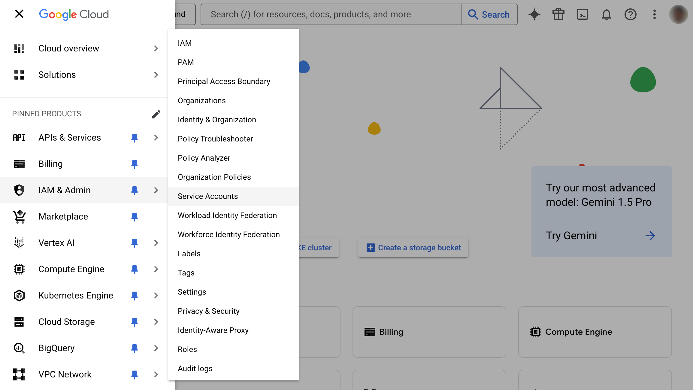
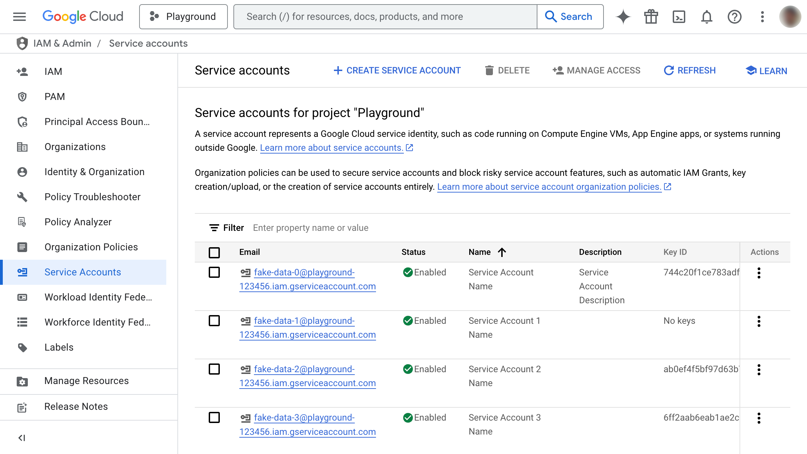
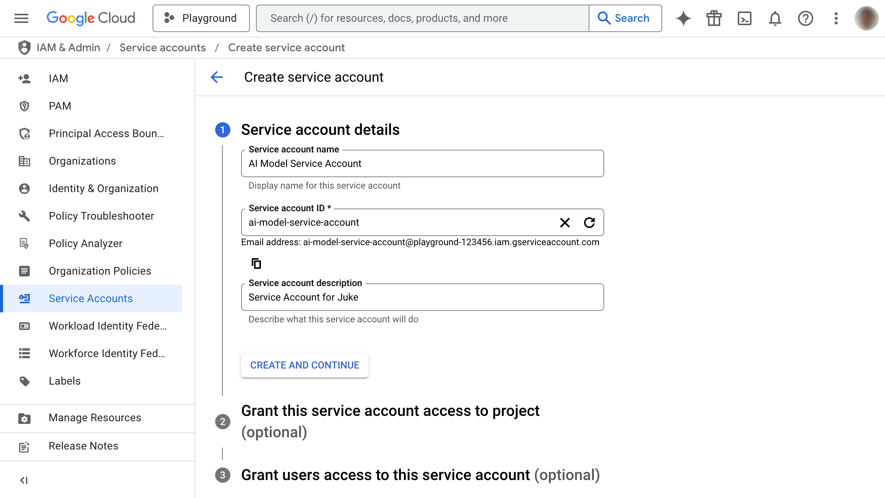
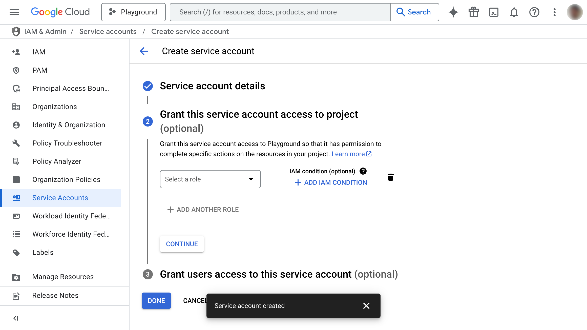
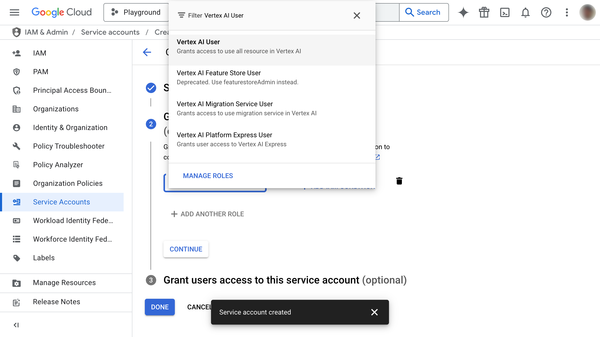
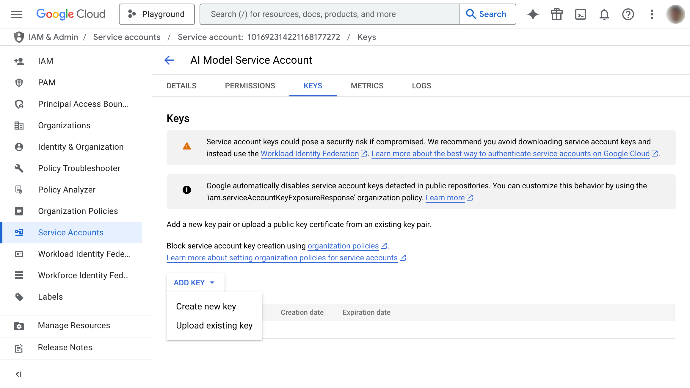
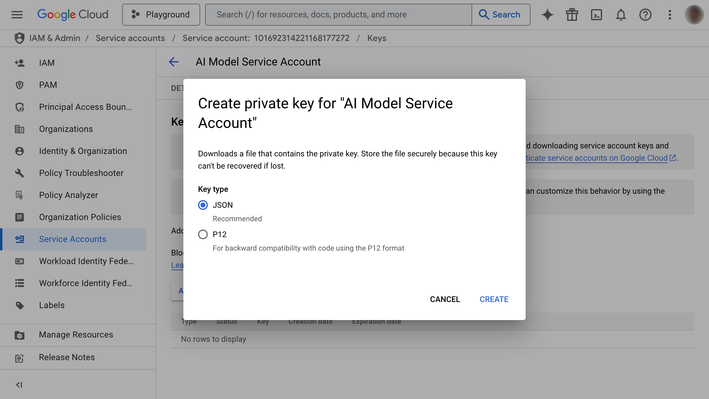
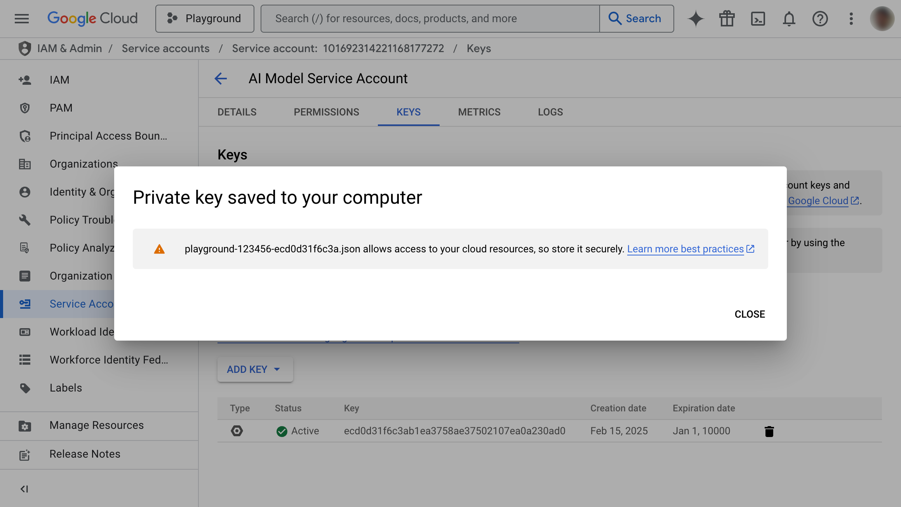

# Service Account Key (SAK)

This guide explains how to create a new Service Account Key (SAK) for your AI models in Google Cloud. To create a new SAK, you can follow the steps below.

## 1. Go to the Google Cloud Console

1. Open your web browser and navigate to the [Google Cloud Console](https://console.cloud.google.com/).
2. If you're not already logged in, sign in with your Google account.
3. Select the project you want to use for your AI models. (If you don’t have a project yet, create one.)

## 2. Navigate to Service Accounts

1. In the Cloud Console navigation menu (usually on the left), click **IAM & Admin**.
2. From the expanded menu, select **Service Accounts**.

   

3. You will be redirected to the page displaying the list of service accounts.

   

## 3. Create a Service Account (if needed)

1. If you already have a suitable service account, skip to [Step 5](#5-create-a-service-account-key). For improved security, it’s recommended to use a dedicated service account for AI models.
2. Click the **+ CREATE SERVICE ACCOUNT** button located in the toolbar at the top of the page (just below the search bar).
3. Enter a descriptive name (e.g., `"AI Model Service Account"`). The **Service account ID** (e.g., `ai-model-service-account`) is generated automatically but can be customized.

   

4. Optionally, add a description.
5. Click **CREATE AND CONTINUE**.

## 4. Grant Permissions to the Service Account

1. Assign the necessary permissions for your AI models. For Vertex AI, select **Vertex AI User** (`roles/aiplatform.user`) or choose a more specific role if required.

   

2. To select the role, click the role dropdown, type **Vertex AI User** (or locate it manually), and select it.

   

3. Click **CONTINUE**.
4. (Optional) To allow specific users to access this service account, add them to the **Service Account User** role.
5. Click **DONE**.

## 5. Create a Service Account Key

1. Return to the list of service accounts via **IAM & Admin → Service Accounts**.
2. Locate your service account and click its email address (formatted as `[SERVICE_ACCOUNT_NAME]@[PROJECT_ID].iam.gserviceaccount.com`).

   

3. Select the **Keys** tab.
4. Click **ADD KEY** and choose **Create new key**.

   

5. Choose **JSON** as the key type.

   

6. Click **CREATE**.
7. A JSON file containing your service account key will be downloaded. **Important:** This is the only time you will be able to download this key.

   

## 6. Use the Service Account Key

- Move the downloaded JSON file to a directory accessible by the XP running the Translator.
